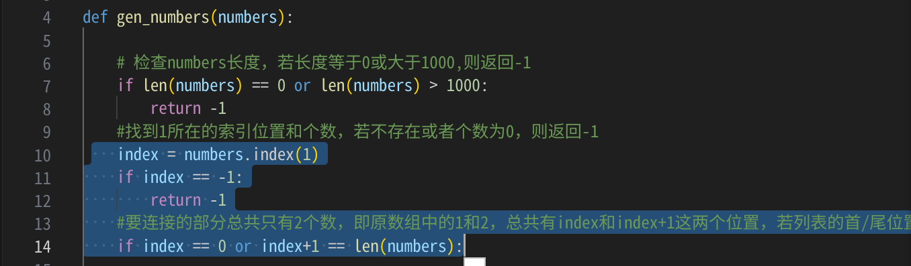
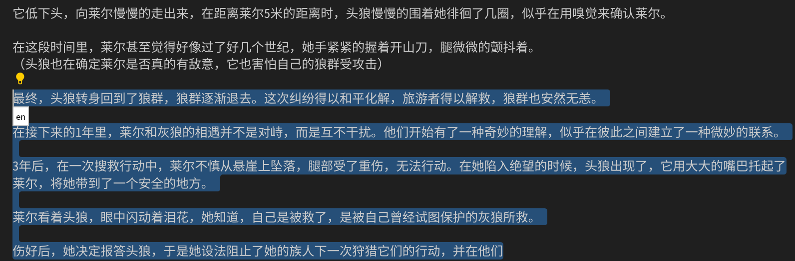

# moon-ai README

 moon-ai是一个简单的vscode扩展，作为一个AI助手，可以支持代码生成、代码解释。

## Features
一个简单的vscode扩展，可以支持OPENAI的国内代理服务网站，也支持text-generation-webui本地部署的模型服务。

v0.0.1
- 支持1.67以上版本安装;
- 支持tab键触发推理，并提示，可用tab进行选择;
- 支持静止5秒后进行提示，以减少对服务端的访问频率;

当前已经测试的模型：
- deepseek-coder-34b-instruct
- nous-hermes-2-mixtral-8x7b-sft.Q4_K_M.gguf (文本生成结果不好，文不对题，可能是api调用问题)
- bagel-dpo-34b-v0.2.Q4_K_M.gguf  （生成的不错，而且有足够的想象力）



### 代码解释
选择一块代码，右键菜单中点击"moon-ai:解释代码"，可以用快捷键"ctrl+shift+e"

### 代码生成
选择一块代码，右键菜单中点击"moon-ai:生成代码"，可以用快捷键"ctrl+shift+m"

## 配置文件
.moon-ai.json文件，放置在当前用户的home目录中

## .moon-ai.json配置文件说明

text-generation-webui的配置文件
```json
{
        "apiKey": "",
        "baseURL": "http://127.0.0.1:5000/v1",
        "model": "gpt-3.5-turbo"
}
```
text-generation-webui的启动命令中要打开api支持
```shell
./start_linux.sh --listen --api
```


OPENAI的配置文件
```json
{
        "apiKey": "sk-XXXXXXX",
        "baseURL": "https://api.XXXXX.com.cn/v1",
        "model": "gpt-3.5-turbo-instruct"
}
```

### 参数解释
- apiKey: OPENAI的API Key，
  - OPENAI的key可以在https://platform.openai.com/account/api-keys中获取
  - 国内代理的服务，请从服务商那里获取
  - text-generation-webui的key留空即可

- baseURL: 代理服务网站的地址，
  - 如果是本地部署的generation-webui，就写http://127.0.0.1:5000/v1，
  - 如果是OPENAI,就直接写https://api.openai.com/v1
  - 如果是国内代理服务，例如可以写https://api.XXXXX.com.cn/v1

- model: 模型名称
  - text-generation-webui网站的模型，留空即可
  - openai则默认是gpt-3.5-turbo-instruct,


**Enjoy!**
